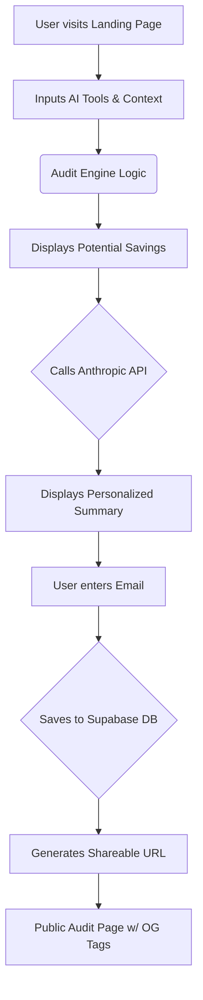

# Architecture

## System Diagram

## Data Flow
1. A cold visitor lands on the Next.js page. Their input is temporarily cached in `localStorage`.
2. Upon submission, the Next.js client component calls the core `auditEngine` function synchronously to compute savings based on the hardcoded `pricingData`.
3. The results are rendered immediately to the user. Simultaneously, a request is made to the Next.js API route `/api/summary` to generate a personalized AI summary.
4. If the user decides to capture the report, they submit their email via the `LeadCapture` component. This POSTs to `/api/save-audit`, which writes the data to Supabase and returns a unique `id`.
5. The `id` is used to generate a shareable Next.js route `/share/[id]`, which performs a Server-Side fetch to Supabase to inject Open Graph meta tags before rendering the page.

## Stack Choice
- **Next.js (App Router) + React**: Chose for its seamless blend of client-side interactivity (the complex form) and server-side rendering (critical for dynamic OG tags on the shareable links).
- **TypeScript**: Ensures the complex pricing logic and audit interfaces are strictly typed, reducing runtime errors.
- **Tailwind CSS**: Rapid UI prototyping for a premium, polished design without heavy CSS bundles.
- **Supabase**: A real Postgres backend that takes seconds to configure, perfect for storing leads and generating unique share links.

## Scaling to 10k audits/day
If this tool scaled to 10k audits a day:
1. **Database Connection Pooling**: I would configure Supabase connection pooling (PgBouncer) or migrate to a more robust Vercel Postgres setup to handle the concurrent writes.
2. **Caching AI Summaries**: I would cache the Anthropic API responses in Redis based on a hash of the user's input. Many startups have identical stacks (e.g., 5 devs using Copilot + ChatGPT), so computing the AI summary from scratch every time is wasteful.
3. **Queueing Lead Emails**: Instead of sending transactional emails synchronously in the `/api/save-audit` route, I would push the job to an event queue (like Upstash Kafka or an AWS SQS queue) to be processed by a background worker.
